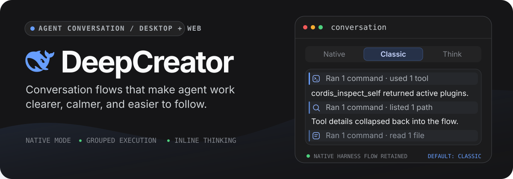

<p align="center">
  English · <a href="./README.zh-CN.md">简体中文</a>
</p>

<p align="center">
  
</p>

<p align="center">
  See agent work as a readable flow—not a wall of tool calls.
</p>

<p align="center">
  <a href="#three-ways-to-read-agent-work">Conversation modes</a> ·
  <a href="#an-industrial-interface-not-a-skin">Industrial UI</a> ·
  <a href="#a-growing-set-of-useful-plugins">Plugin roadmap</a> ·
  <a href="#quick-start">Quick start</a> ·
  <a href="#architecture">Architecture</a> ·
  <a href="https://github.com/deepseek-ai/deepseek-harness">Upstream Harness</a>
</p>

DeepCreator is an independent Desktop and Web presentation distribution for the official [DeepSeek Harness](https://github.com/deepseek-ai/deepseek-harness). Its primary focus is the conversation experience: it keeps the stock Harness flow available as **Native mode**, then adds **Classic** and **Think** modes to make long-running agent work easier to read, inspect, and follow.

The interaction takes cues from the task-centered reading rhythm of Claude Desktop and Codex while preserving the official Harness Host, Agent, Session, Runtime, RPC, Settings, Workspace, and Slot systems.

## Three ways to read agent work

| Mode | Best for | Flow behavior |
| --- | --- | --- |
| **Native** | Following the original Harness experience | Preserves the stock conversation flow and remains the stable fallback |
| **Classic** | Reading the result and the work without reasoning noise | Hides reasoning, groups contiguous tool calls into expandable execution runs, and aggregates work across steps between content anchors |
| **Think** | Following how the agent reaches a result | Shows reasoning inline and keeps execution runs scoped to individual steps |

Classic is the initial default. The default-mode control in Settings and the current session's header picker stay synchronized, so switching modes updates the active session immediately and sets the default inherited by later sessions.

### From tool noise to execution flow

- **Grouped runs, not repetitive cards.** Related reads, edits, searches, commands, and other tool calls become one clear execution run with an expandable body.
- **Stable streaming.** The flow isolates the streaming tail, preserves keyed rows, and keeps reader position stable while the agent continues working.
- **Progress that reads naturally.** Turn status, active work, queued messages, approvals, todo progress, compaction checkpoints, and context injections remain in their chronological place.
- **Detail when it matters.** Tool input and output stay available through expandable rows and the local details inspector instead of dominating the transcript.
- **A dedicated Trajectory view.** For deeper analysis, a turn-aware event ledger exposes steps, nested tools, timing, token usage, search, folding, and a zoomable execution overview.

## An industrial interface, not a skin

The conversation flow comes first; the rest of the product is shaped into a restrained, desktop-grade working environment around it.

- A calm three-column shell keeps navigation, the active conversation, and contextual detail visually distinct.
- A shared token system controls typography, spacing, color, states, menus, scrollbars, and light/dark appearance across every plugin.
- Consistent rows, controls, focus states, disclosures, inspectors, and code surfaces reduce visual noise during long sessions.
- Model selection, permission presets, agent presets, subagent routing, workspaces, settings, and user questions follow the same interaction grammar.

## A growing set of useful plugins

DeepCreator is designed to keep expanding without turning into a monolith. Future releases will gradually add useful plugins around conversation views, execution tools, workspace actions, agent workflows, and desktop productivity.

Each addition follows the same boundary: one feature, one independently composed Cordis plugin. A plugin can register its own Slots, Services, Events, settings, stores, and views, then be disabled or disposed without copying or replacing the official Harness business state.

## Quick start

### Requirements

- Node.js `^22.19 || >=24`
- [pnpm](https://pnpm.io/)

### Run the desktop app

```sh
pnpm install
pnpm run build
pnpm run profile:migrate
pnpm run dev:desktop
```

`profile:migrate` creates the managed `deepcreator` profile from the existing `web` profile. It backs up both profiles, retains third-party bundles and user patches, removes legacy ExecFlow rows, links the local Client plugins, and validates the assembled Cordis tree. Re-running it refreshes the managed profile without duplicating rows; the original `web` profile remains the rollback path.

## Architecture

DeepCreator changes the presentation layer without forking the Harness runtime:

| Layer | Owner | Responsibility |
| --- | --- | --- |
| Desktop process | DeepCreator | Electron lifecycle, Host child process, navigation policy, shutdown |
| Presentation bundle | DeepCreator | Cordis rows and 16 Client plugin dependencies |
| UI features | DeepCreator | Slot-composed React views and presentation-only stores |
| Runtime and data | DeepSeek Harness | Agent execution, sessions, RPC, settings, workspaces, Client Runtime objects |

The composition order is `dsh-base` → `dsh-web-app` → retained third-party bundles → `dsh-deepcreator-web`. Shared extension points keep their official Slot names; DeepCreator-only child slots use the `deepcreator.*` namespace.

Three rules preserve that boundary:

1. React views receive data and callbacks through Slot-derived props; they do not access Cordis context or Runtime objects directly.
2. Cross-plugin composition uses Slots, Services, Events, and ordinary data—not imports from another feature's internals.
3. Every registration is a reversible effect and is removed when its plugin unloads.

Read [the architecture reference](./docs/architecture/deepcreator.md) for package ownership, composition invariants, and the upstream update procedure.

## Development

```sh
pnpm run typecheck
pnpm run test
pnpm run build
pnpm run verify:harness
```

Tests resolve Harness modules from the pinned npm packages, so the repository does not depend on a neighboring Harness source checkout. Rebuild Client packages before browser or Desktop validation because the Host serves `lib/client.js`.

### Repository map

| Path | Purpose |
| --- | --- |
| `apps/desktop/` | Electron window, Host child process, navigation, and shutdown lifecycle |
| `packages/client/ui-conversation/` | Conversation shell, Native/Classic/Think modes, streaming flow, composer |
| `packages/client/ui-trajectory/` | Turn-aware execution ledger, overview, timing, and record inspector |
| `packages/client/ui-tool/` | Keyed tool renderers, grouped tool presentation, and tool details |
| `packages/client/` | Remaining feature-domain plugins, compatibility declarations, and UI primitives |
| `packages/bundle/deepcreator-web/` | Public presentation bundle and Cordis patch |
| `scripts/profile-migrate/` | Managed development-profile creation and validation |
| `scripts/verify-harness/` | Supported-version and composition-invariant checks |
| `UI_STYLE_GUIDE.md` | Product typography, interaction, and component styling rules |
| `.agents/skills/` | Generic DSH workflows and DeepCreator-specific agent guidance |

### Compatibility and release scope

The current compatibility declaration targets DeepSeek Harness `0.1.0-rc.6` at Git SHA `47f943859bef60e4160492346772ded9b24f765a`.

> [!IMPORTANT]
> DeepCreator currently ships as a **development runtime**. Signing, notarization, installers, auto-update, tray integration, and native credential storage are intentionally outside the initial desktop release.

### Repository-aware agents

Start with [`.agents/skills/deepcreator-cordis-development/SKILL.md`](./.agents/skills/deepcreator-cordis-development/SKILL.md). It conditionally loads the generic composition and plugin-development workflows so pure UI work does not consume unrelated Cordis context.
