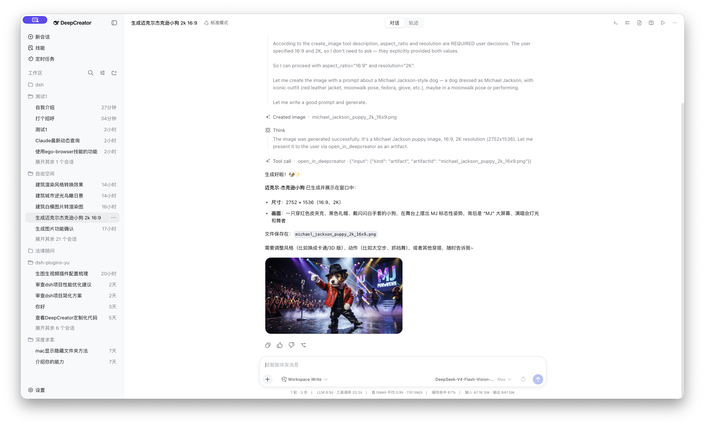
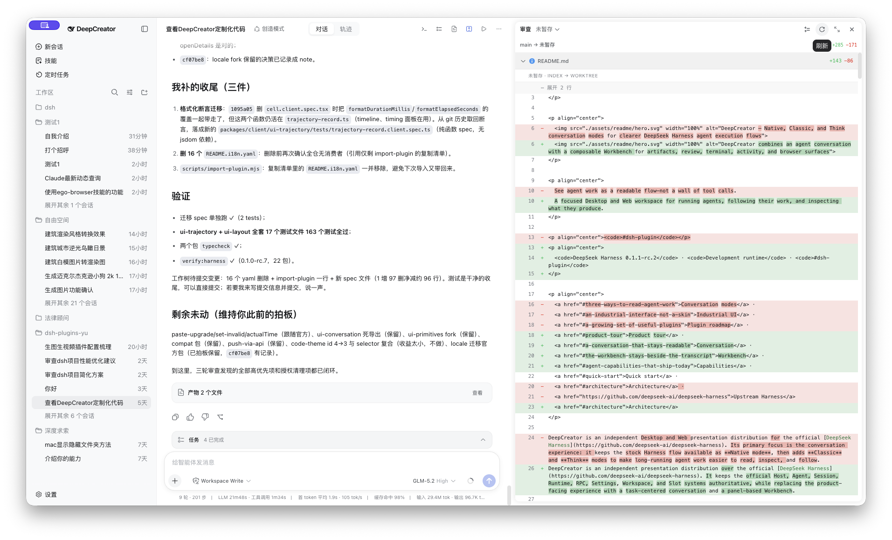

<p align="center">
  <a href="./README.md">English</a> · 简体中文
</p>

<p align="center">
  
</p>

<p align="center">
  一个用于运行智能体、跟随执行过程并检查最终产物的专注型桌面端与 Web 工作空间。
</p>

<p align="center">
  <code>DeepSeek Harness 0.1.1-rc.2</code> · <code>开发运行时</code> · <code>#dsh-plugin</code>
</p>

<p align="center">
  <a href="#产品导览">产品导览</a> ·
  <a href="#始终可读的智能体对话">智能体对话</a> ·
  <a href="#始终位于对话旁边的-workbench">Workbench</a> ·
  <a href="#当前已经交付的智能体能力">当前能力</a> ·
  <a href="#快速开始">快速开始</a> ·
  <a href="#架构">架构</a>
</p>

DeepCreator 是构建在官方 [DeepSeek Harness](https://github.com/deepseek-ai/deepseek-harness) 之上的独立展示发行版。它继续以官方 Host、Agent、Session、Runtime、RPC、Settings、Workspace 与 Slot 系统为权威，只把产品体验替换为以任务为中心的对话和面板化 Workbench。

你可以在一个界面中阅读长时间运行的智能体、回答审批和提问、检查工具活动、审查仓库变更、打开生成文件、操作终端或浏览器、跟随子智能体，并管理当前工作区真正对 Agent 生效的 Skills。

## 产品导览

<p align="center">
  <a href="./assets/readme/product-conversation.png"></a>
</p>

<p align="center"><sub>当前版本的 DeepCreator 会话：工作区导航、可读工具流、生成式媒体、模型与权限控制，以及实时执行统计。</sub></p>

| 区域 | 当前已经提供 |
| --- | --- |
| **对话** | 原生、经典、思考三种模式；稳定流式展示；聚合工具执行；审批、提问、计划、Todo、排队消息、上下文压缩、重试与上下文注入 |
| **Workbench** | 按会话隔离的终端、活动、产物、审查、浏览器面板；支持标签页、Mosaic 布局、聚焦模式、响应式摆放和视图状态记忆 |
| **产物** | Produced-file 卡片、Markdown／代码／图片／PDF／Word 查看器、HTML 预览交接、生成图片附件及显式应用内呈现 |
| **智能体操作** | 图形化 Skills 管理、浏览器自动化、图片生成、模型与权限选择、预设、工作区／会话搜索、子智能体对话和执行轨迹 |
| **运行表面** | 沙箱化 Electron 桌面端、同一套组合式 Web UI，以及可选的可信局域网手机配对访问 |

## 始终可读的智能体对话

DeepCreator 完整保留 Harness 官方对话作为**原生模式**，并增加两种任务阅读模式：

| 模式 | 适合场景 | 展示方式 |
| --- | --- | --- |
| **原生** | 继续使用 Harness 原有体验 | 保留官方对话流，同时作为稳定回退模式 |
| **经典** | 关注结果和执行过程，减少思考噪声 | 隐藏思考，把连续工具组织为可展开的执行段，让助手正文保持连续 |
| **思考** | 跟随智能体如何得出结果 | 行内展示思考内容，并让每段工具执行保持在对应步骤范围内 |

经典模式是初始默认值。当前会话的选择器与默认偏好双向同步：切换会立即作用于当前会话，也会成为后续会话的起始模式。

这不只是一个渲染器开关：

- 工具通过 keyed registration 分派，因此专用卡片、第三方工具与未知工具可以共存，不需要中心 switch。
- 流式尾部、已结算行、阅读位置、历史分页和重试状态在长时间任务中保持稳定。
- 审批、计划审阅和用户提问会原位接管输入区，Host 解决等待后再把输入区交还给用户。
- Todo、排队消息、Steer、上下文压缩检查点、上下文注入、Token 统计和终止错误都留在正确的时间位置。
- **Trajectory** 提供虚拟化、按轮次组织的事件记录，覆盖嵌套工具、耗时、Token、搜索、折叠、记录检查和可缩放执行概览。

## 始终位于对话旁边的 Workbench

Workbench 是右侧的上下文工作空间，不是脱离会话的开发者控制台。多个面板可以组成 Mosaic，同类面板可开多个标签页，也可进入聚焦模式；布局按会话保存，并能从桌面多列自然切换到手机全屏覆盖。

<p align="center">
  <a href="./assets/readme/product-workbench.png"></a>
</p>

<p align="center"><sub>仓库工作始终连接到所属对话：无需离开产生变更的对话，就能查看完整变更范围。</sub></p>

| 面板 | 提供的能力 |
| --- | --- |
| **终端** | 在会话工作区启动本机交互式 Shell，支持原始 ANSI I/O、尺寸调整和多标签；生命周期继续由官方 Terminal Service 管理 |
| **活动** | 列出后台任务与子智能体、停止属于当前会话的任务，并打开复用主对话渲染器的子会话记录，不复制 Session 状态 |
| **产物** | 投影智能体真正写入或编辑的文件；原位渲染代码、Markdown/MDX、图片、PDF、DOCX、DOC；显式 HTML 预览交给 Browser |
| **审查** | 查看未暂存、已暂存、未提交、当前轮次与历史轮次范围；虚拟化大型 Diff、支持嵌套仓库，并能安全撤销最新的单仓库未解决轮次 |
| **浏览器** | 通过内置 Electron、受管 Playwright 或显式共享的 Chrome Provider 呈现与 Provider 无关的浏览器标签和快照 |

Artifact 与 Review 刻意保持独立：Artifact 回答“智能体产出了什么”，Review 回答“仓库发生了什么变化”。二进制产物作为交付物展示，不会重复进入逐行代码审查卡。

## 当前已经交付的智能体能力

### 与工作区一致的 Skills 管理

图形化 Skills 页面读取当前 Agent 与工作区真正生效的官方注册表。它支持双语搜索、启用／禁用、详情与作者信息、受保护的复制／链接／Git 安装，以及从标准个人或项目 Skill 根目录删除。禁用 Skill 会同时改变模型与用户调用策略，但不会重写 Provider 的源文件。

### 带持久结果的图片生成

根 Agent 可以通过配置好的 **OpenAI Images**、**火山方舟 Seedream** 或 **Gemini** Provider 调用 `create_image`。Provider 配置保存在官方 Settings 中，凭证由官方 Credentials 服务解析，Desktop 会继承系统代理，同时以按轮次的重试与熔断边界阻止失控失败循环。每次成功生成都会写入一个工作区 PNG，并形成持久的对话附件。

### 不泄漏 Provider 内部对象的 Browser Use

Browser Core 只暴露语义化导航、交互、快照与标签页操作，Electron `WebContents`、Playwright 对象、Chrome 调试句柄和原生 IPC 都留在 Provider 边界后面。

- 内置 Browser 使用沙箱化 Electron Surface 和认证后的私有 Desktop RPC。
- 受管 Chromium、Firefox、WebKit 提供语义化自动化和 `playwright_run`；脚本在 QuickJS/WASM 中执行，没有 Node globals、文件系统、process 或 socket 权限。
- 系统 Chrome 集成只共享用户通过扩展按钮明确批准的标签页，也不会打开远程调试端口。

### 显式呈现，而不是猜测面板是否打开

`open_in_deepcreator` 通过 resolver、capability、claim、receipt、timeout 和 dismissal 边界协调 Artifact 与 Browser 资源。Host 能知道资源是否真正完成呈现；原生 Surface 挂载失败不会被误认为成功打开了面板。

### 围绕任务的完整产品流程

- 工作区分组、会话置顶、手动／按更新时间排序、标题／路径／内容搜索、Fork、归档与待交互状态。
- Agent 与模型预设、思考强度、权限预设、Full Access 风险确认和结构化用户提问。
- 直接连接到 Artifact 与 Review 的产物卡和逐轮变更卡。
- 一套统一字体、代码、Diff、控件、菜单、焦点、滚动条及明暗外观的语义主题系统。

## 一套组合，三种运行表面

| 表面 | 行为 |
| --- | --- |
| **桌面端** | 沙箱化 Electron 窗口、动态 loopback 端口上的官方 `dsh` 子进程、严格导航策略、macOS 原生红黄绿按钮、跟随主题的 Windows Window Controls Overlay 与 Linux 原生窗口框架 |
| **Web** | 由官方 Host 提供的同一套 Client row 组合，不维护第二份产品状态或替代 UI 实现 |
| **可信局域网手机** | 可选设备配对到同一套响应式 Web UI；Activity、Artifact 与只读 Review 保留，Browser、Terminal、本机路径操作和特权管理继续被隔离 |

> [!WARNING]
> 可信局域网访问使用经过认证、但**没有传输加密的 HTTP**。它默认关闭、不安装证书，绝不能暴露到公共网络或互联网。

## 快速开始

### 环境要求

- Node.js `^22.19 || >=24`
- [pnpm](https://pnpm.io/)

### 启动 DeepCreator Desktop

```sh
pnpm install
pnpm run build
pnpm run profile:migrate
pnpm run dev:desktop
```

`profile:migrate` 会基于现有 `web` profile 创建受管理的 `deepcreator` profile。它会备份两个 profile，保留无关的第三方 Bundle 与用户 patch，移除旧 row，链接本地插件，并验证最终 Cordis 树。后续 Desktop 启动只运行轻量的 `profile:ensure`，仅当受管理组合过期时才执行迁移。

原始 `web` profile 始终保留为回退路径。

<details>
<summary><strong>向受管理 profile 添加 Harness 官方插件</strong></summary>

DeepCreator 保持官方 Host 与 Agent 插件缝开放。请安装与锁定 Harness 运行时一致的版本，把插件文档中的 Cordis row 加入 `$DSH_HOME/profiles/deepcreator/cordis.patch.yml`，检查完整组合后再重启：

```sh
pnpm --filter @ryanyujazz/dsh-deepcreator-desktop exec dsh plugin --profile deepcreator add @deepseek-ai/dsh-mcp-client@0.1.1-rc.2
pnpm --filter @ryanyujazz/dsh-deepcreator-desktop exec dsh --profile deepcreator --dump-config
```

已按锁定运行时核对的官方扩展包括 MCP Server、DeepSeek Web 搜索／抓取、Worker Thread 智能体工作流和主动选择启用的 OpenTelemetry。安装 package 本身不会自动激活 Cordis row。

</details>

## 架构

DeepCreator 改变展示层和产品工作流，但不 fork Harness 业务状态：

| 层级 | 所有者 | 职责 |
| --- | --- | --- |
| Desktop 进程 | DeepCreator | Electron 生命周期、官方 Host 子进程、系统代理投影、Browser Surface 边界、导航与关闭 |
| Host 功能插件 | DeepCreator | Browser、Presentation、Artifact、Review、Terminal Workbench、Skills 管理、图片生成、Jobs／Session 管理与可信局域网访问 |
| 展示 Bundle | DeepCreator | Cordis row 的声明式替换／插入及完整插件依赖闭包 |
| Client 功能 | DeepCreator | 通过 Slot 组合的 React 视图和纯展示状态，一个功能一个 package |
| 运行时与业务数据 | DeepSeek Harness | Agent 执行、Sessions、工作区、RPC、Settings、Credentials、Tools、Client Runtime 对象和官方扩展点 |

组合顺序为 `dsh-base` → `dsh-web-app` → 保留的第三方 Bundles → `dsh-deepcreator-web`。`dsh --profile deepcreator --dump-config` 的输出是当前组合树的权威。

以下三条规则让发行版可以独立升级：

1. React view 只消费 props；Runtime 或 Remote 数据由 adapter 与 assembly 读取。
2. 跨插件 UI 使用 Slots，行为使用公开 Services、Events、stores、callbacks 与普通数据。
3. 所有注册都可逆，官方 Agent／Session／Runtime／Workspace／Settings 状态永远不会复制进展示 store。

更完整的包归属、Slot、组合约束、兼容声明与上游升级流程见[架构说明](./docs/architecture/deepcreator.md)。

### 仓库结构

| 路径 | 用途 |
| --- | --- |
| `apps/desktop/` | Electron 窗口、官方 Host 子进程、原生 Browser Surface、导航与关闭 |
| `packages/host/` | DeepCreator 拥有的 Host 服务与 Agent 能力 |
| `packages/client/ui-conversation/` | 对话 Shell、三种渲染模式、流式流程、输入区、队列与状态 |
| `packages/client/ui-workbench*/` | Workbench Shell，以及 Activity、Artifact、Review、Terminal Provider |
| `packages/client/ui-browser/` | Browser 状态与默认 Workbench Presenter |
| `packages/client/ui-skills/` | 图形化有效 Skill 目录与生命周期控制 |
| `packages/client/ui-image-generation/` | 图片生成设置、工具行与生成式媒体 |
| `packages/client/ui-trajectory/` | 按轮次组织的执行记录、时间线、搜索与检查器 |
| `packages/bundle/deepcreator-web/` | 公开展示 Bundle 与权威 Cordis patch |
| `scripts/profile-migrate/` | 受管理 profile 迁移及幂等启动检查 |
| `scripts/verify-harness/` | 支持版本与组合约束验证 |
| `UI_STYLE_GUIDE.md` | 产品排版、交互、组件与平台窗口规范 |

## 兼容性与当前范围

当前兼容声明面向 DeepSeek Harness `0.1.1-rc.2`，Git SHA 为 `b150a551b8d465e31e418e1b2eaf5e79bbb7d28e`。

> [!IMPORTANT]
> DeepCreator 当前提供的是**开发运行时**。签名、公证、安装包、自动更新、托盘集成和原生凭据存储仍不在当前桌面版范围内。Review 不提供 stage、unstage 或 commit 操作；可信局域网访问也不是 TLS 或 PWA 部署方案。

## 开发

```sh
pnpm run typecheck
pnpm run test
pnpm run build
pnpm run verify:harness
```

测试直接从锁定版本的 npm packages 解析 Harness 模块，因此仓库不依赖相邻的 Harness 源码 checkout。浏览器或桌面端验证前需要重建 Client packages，因为 Host 提供的是 `lib/client.js`。

面向仓库的智能体任务请从 [`.agents/skills/deepcreator-cordis-development/SKILL.md`](./.agents/skills/deepcreator-cordis-development/SKILL.md) 开始。

第三方归属信息见 [THIRD_PARTY_NOTICES.md](./THIRD_PARTY_NOTICES.md)。
