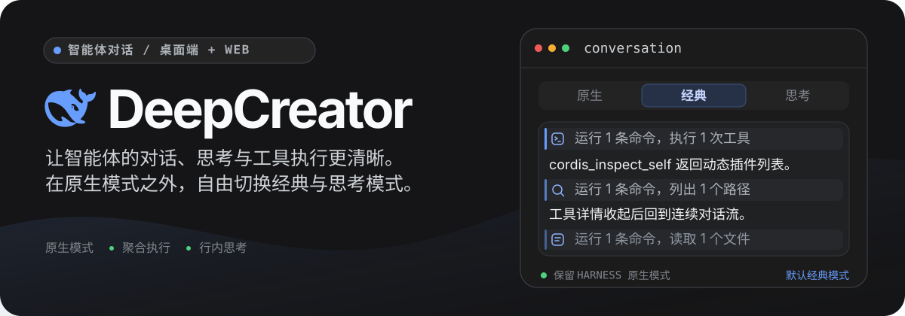
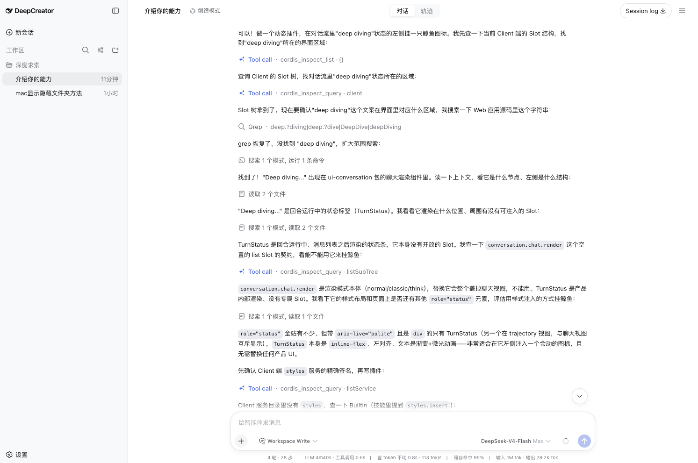

<p align="center">
  <a href="./README.md">English</a> · 简体中文
</p>

<p align="center">
  
</p>

<p align="center">
  把智能体的工作过程变成可读的执行流，而不是堆叠的工具调用卡片。
</p>

<p align="center"><code>#dsh-plugin</code></p>

<p align="center">
  <a href="#三种对话流模式">对话流模式</a> ·
  <a href="#工业化界面而不只是换肤">工业化界面</a> ·
  <a href="#持续增加实用插件">插件扩展</a> ·
  <a href="#快速开始">快速开始</a> ·
  <a href="#架构">架构</a> ·
  <a href="https://github.com/deepseek-ai/deepseek-harness">上游 Harness</a>
</p>

DeepCreator 是构建在官方 [DeepSeek Harness](https://github.com/deepseek-ai/deepseek-harness) 之上的独立桌面端与 Web 展示发行版。它首先优化的是对话体验：完整保留 Harness 原有对话流作为**原生模式**，并提供**经典模式**与**思考模式**，让长时间运行的智能体任务更易阅读、检查和跟随。

交互设计借鉴了 Claude Desktop 与 Codex 以任务为中心的阅读节奏，同时继续复用官方 Harness 的 Host、Agent、Session、Runtime、RPC、Settings、Workspace 与 Slot 系统。

<p align="center">
  <a href="./assets/readme/classic-conversation-flow.png"></a>
</p>

<p align="center"><sub>经典模式把助手输出与紧凑工具摘要组织在一条连续、清晰的对话流中。</sub></p>

## 三种对话流模式

| 模式 | 适合场景 | 展示方式 |
| --- | --- | --- |
| **原生模式** | 继续使用 Harness 原有体验 | 保留官方原生对话流，同时作为稳定回退模式 |
| **经典模式** | 关注结果和执行过程，减少思考噪声 | 隐藏思考内容，将连续工具调用组织成可展开的执行段，并在正文锚点之间跨步骤聚合 |
| **思考模式** | 跟随智能体如何得出结果 | 行内展示思考内容，并让每段工具执行保持在对应步骤范围内 |

经典模式是初始默认模式。设置页的默认模式控件与当前会话标题栏中的模式选择器双向同步：切换后会立即更新当前会话，并成为后续新会话继承的默认值。

### 从工具噪声到执行流

- **聚合执行，而不是重复卡片。** 相关的读取、编辑、搜索、命令及其他工具调用被组织为一段清晰的执行过程，详细内容按需展开。
- **稳定的流式展示。** 对话流隔离流式尾部、保持稳定行键，并在智能体持续工作时尽量维持读者当前位置。
- **自然可读的进度。** 轮次状态、当前工作、排队消息、审批、待办进度、上下文压缩和上下文注入都保留在正确的时间位置。
- **需要时再查看细节。** 工具输入输出通过展开行与局部详情检查器提供，而不会长期占据对话正文。
- **独立的 Trajectory 视图。** 面向深度分析提供按轮次组织的事件记录、步骤、嵌套工具、耗时、Token 用量、搜索、折叠和可缩放执行概览。

## 工业化界面，而不只是换肤

对话流是核心，其他界面则围绕它形成克制、稳定、适合长时间工作的桌面环境。

- 三栏工作区明确区分导航、当前对话与上下文详情。
- 统一语义变量约束所有插件中的字体、间距、颜色、状态、菜单、滚动条及明暗主题。
- 一致的行高、控件、焦点态、展开交互、检查器和代码界面降低长会话中的视觉噪声。
- 模型选择、权限预设、智能体预设、子智能体路由、工作区、设置和用户提问遵循同一套交互语法。

## 持续增加实用插件

DeepCreator 会持续扩展，但不会演变成一个难以拆分的单体应用。后续版本将围绕对话视图、执行工具、工作区操作、智能体工作流与桌面效率陆续增加实用插件。

每项新增能力仍遵循同一边界：一个功能对应一个可独立组合的 Cordis 插件。插件可以注册自己的 Slots、Services、Events、设置、Store 与视图，也可以被单独禁用或卸载，而不复制或替换 Harness 官方业务状态。

### 现在即可安装

DeepCreator 保持官方 Harness 的 Host 与 Agent 插件扩展面开放。以下公开包已按仓库锁定的 `@deepseek-ai/dsh` `0.1.0-rc.7` 运行时完成核对：

| 能力 | 可安装包 | 提供的功能 |
| --- | --- | --- |
| MCP 服务器 | [`@deepseek-ai/dsh-mcp-client`](https://www.npmjs.com/package/@deepseek-ai/dsh-mcp-client) | 连接 `stdio` 或 Streamable HTTP MCP 服务器，并将工具注册为 `mcp__<server>__<tool>` |
| 网页搜索与抓取 | [`@deepseek-ai/dsh-tool-web`](https://www.npmjs.com/package/@deepseek-ai/dsh-tool-web) + [`@deepseek-ai/dsh-web-search-deepseek`](https://www.npmjs.com/package/@deepseek-ai/dsh-web-search-deepseek) | 增加由 DeepSeek Web 能力驱动的 `web_search` 与 `web_fetch` 工具 |
| 智能体工作流 | [`@deepseek-ai/dsh-tool-workflow`](https://www.npmjs.com/package/@deepseek-ai/dsh-tool-workflow) + [`@deepseek-ai/dsh-workflow-worker-thread`](https://www.npmjs.com/package/@deepseek-ai/dsh-workflow-worker-thread) | 在 Worker Thread 中编排多个子智能体；它用于保持主进程响应，不是安全沙箱 |
| OpenTelemetry | [`@deepseek-ai/dsh-session-telemetry-otel`](https://www.npmjs.com/package/@deepseek-ai/dsh-session-telemetry-otel) | 明确选择启用后把会话遥测导出到 OTLP/HTTP Collector；会话内容可能被包含，启用前应检查脱敏策略 |

请使用与当前 Harness 运行时一致的版本把包安装到受管理 profile，再将插件文档中的 Cordis row 加入 `$DSH_HOME/profiles/deepcreator/cordis.patch.yml`：

```sh
pnpm --filter @ryanyujazz/dsh-deepcreator-desktop exec dsh plugin --profile deepcreator add @deepseek-ai/dsh-mcp-client@0.1.0-rc.7
pnpm --filter @ryanyujazz/dsh-deepcreator-desktop exec dsh --profile deepcreator --dump-config
```

完成 `pnpm install` 后即可使用上面的工作区本地命令；如果 `dsh` 已在 `PATH` 中，也可以使用更短的 `dsh plugin ...` 写法。安装包不会自动激活 Cordis row；添加插件文档要求的配置，用 `--dump-config` 核对完整组合后，再重启 DeepCreator。基于相同公开 Cordis Services 与工具注册表构建的第三方 Host 或 Agent 插件也可以沿用这一安装路径；自定义 Client UI 插件则需要接入保留的官方 Slots 或 DeepCreator 已记录的 `deepcreator.*` 扩展点。未知工具名仍会使用通用工具渲染器，不会从经典模式或思考模式中消失。

## 快速开始

### 环境要求

- Node.js `^22.19 || >=24`
- [pnpm](https://pnpm.io/)

### 启动桌面端

```sh
pnpm install
pnpm run build
pnpm run profile:migrate
pnpm run dev:desktop
```

`profile:migrate` 会基于现有 `web` profile 创建受管理的 `deepcreator` profile。它会备份两个 profile，保留第三方 bundle 与用户 patch，移除旧 ExecFlow rows，链接本地 Client 插件，并验证最终 Cordis 树。重复运行只会刷新受管理的 profile，不会产生重复 rows；原始 `web` profile 始终保留为回退路径。

## 架构

DeepCreator 只替换展示层，不 fork Harness 运行时：

| 层级 | 所有者 | 职责 |
| --- | --- | --- |
| 桌面进程 | DeepCreator | Electron 生命周期、Host 子进程、导航策略与关闭流程 |
| 展示 Bundle | DeepCreator | Cordis rows 与 16 个 Client 插件依赖 |
| UI 功能 | DeepCreator | 通过 Slot 组合的 React 视图与纯展示状态 |
| 运行时与业务数据 | DeepSeek Harness | 智能体执行、会话、RPC、设置、工作区及 Client Runtime 对象 |

组合顺序为 `dsh-base` → `dsh-web-app` → 保留的第三方 bundles → `dsh-deepcreator-web`。共享扩展点继续使用官方 Slot 名称，只有 DeepCreator 拥有的子 Slot 使用 `deepcreator.*` 命名空间。

以下规则用于维持边界：

1. React 视图通过 Slot 派生的 props 接收数据与回调，不直接访问 Cordis context 或 Runtime 对象。
2. 跨插件组合使用 Slots、Services、Events 与普通数据，不导入其他功能插件的内部实现。
3. 所有注册都是可逆 effect，插件卸载时会移除其拥有的注册。

详细的包归属、组合约束和上游升级流程见[架构说明](./docs/architecture/deepcreator.md)。

## 开发

```sh
pnpm run typecheck
pnpm run test
pnpm run build
pnpm run verify:harness
```

测试直接从固定版本的 npm packages 解析 Harness 模块，因此仓库不依赖相邻的 Harness 源码 checkout。进行浏览器或桌面端验证前请重新构建 Client packages，因为 Host 提供的是 `lib/client.js`。

### 仓库结构

| 路径 | 用途 |
| --- | --- |
| `apps/desktop/` | Electron 窗口、Host 子进程、导航及关闭生命周期 |
| `packages/client/ui-conversation/` | 对话壳、原生／经典／思考模式、流式展示及输入区 |
| `packages/client/ui-trajectory/` | 按轮次组织的执行记录、概览、计时与记录检查器 |
| `packages/client/ui-tool/` | Keyed 工具渲染器、聚合工具展示及工具详情 |
| `packages/client/` | 其他功能域插件、兼容声明与 UI 原语 |
| `packages/bundle/deepcreator-web/` | 公共展示 Bundle 与 Cordis patch |
| `scripts/profile-migrate/` | 受管理开发 profile 的创建与验证 |
| `scripts/verify-harness/` | 支持版本与组合约束检查 |
| `UI_STYLE_GUIDE.md` | 产品排版、交互与组件样式规则 |
| `.agents/skills/` | 通用 DSH 工作流与 DeepCreator 专用智能体指引 |

### 兼容性与发布范围

当前兼容声明面向 DeepSeek Harness `0.1.0-rc.7`，Git SHA 为 `99f6f02fecdb7dff40c3fbc9470f5907c29f74ca`。

> [!IMPORTANT]
> DeepCreator 当前提供的是**开发运行时**。签名、公证、安装包、自动更新、托盘集成与原生凭据存储不在首个桌面版本范围内。

### 面向仓库的智能体

请从 [`.agents/skills/deepcreator-cordis-development/SKILL.md`](./.agents/skills/deepcreator-cordis-development/SKILL.md) 开始。它会按任务条件加载通用 composition 与 plugin-development 工作流，避免纯 UI 工作消耗无关的 Cordis 上下文。
